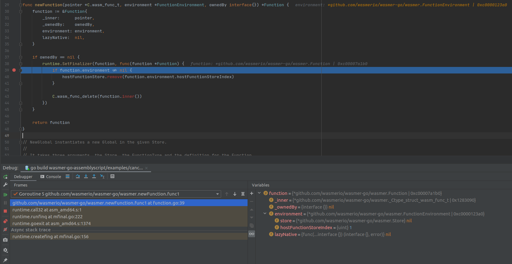

# Запускаем AssemblyScript в Go
Пока одни обсуждают [что не так с WebAssembly](https://habr.com/ru/company/ruvds/blog/539100/), я думаю как его можно использовать вне браузера.
Например написание [wasm фильтров](https://www.envoyproxy.io/docs/envoy/v1.17.0/configuration/http/http_filters/wasm_filter#config-http-filters-wasm) для Envoy.
AssemblyScript был взят потому, что это не C++ и не Rust, т.е. ожидается более низкий порог вхождения. Под катом будет
дико примитивный код и пару бенчмарков. Картинка взята из бенчмарка.


## Рантаймы доступные для Go
Более менее живые проекты которые имеют биндинги, для Go:
* [wasmer-go](https://github.com/wasmerio/wasmer-go);
* [wasmtime-go](https://pkg.go.dev/github.com/bytecodealliance/wasmtime-go);
* [go-wasm3](https://github.com/matiasinsaurralde/go-wasm3).

Изначально пробовал запустить [life](https://github.com/perlin-network/life), но столкнувшись с двумя
багами в life и последним коммит от 2019 понял, что проект мертв. Повелся из-за возможности указать лимит на
количество операций([gas metering](https://godoc.org/github.com/perlin-network/life/exec#VirtualMachine.RunWithGasLimit)). 
В wasmer [metering](https://docs.wasmer.io/ecosystem/wasmer/wasmer-features), но в wasmer-go пока недоступно.

## Hello World!
Если посмотреть примеры, то типичный hello world это:
```rust
extern {
    fn sum(x: i32, y: i32) -> i32;
}

#[no_mangle]
pub extern fn add1(x: i32, y: i32) -> i32 {
    unsafe { sum(x, y) + 1 }
}
```
Что делать, строк в MVP не завезли. Нам доступны только числовые типы [i32, i64, f32, f64](https://webassembly.github.io/spec/core/text/types.html).
Посмотрим во что превратится этот код:
```typescript
import {console} from "../../assemblyscript/go";

export function hello(): void{
    console.log("Hello World!")
}

// go.ts
export declare namespace console {
    export function log(s: string): void
}
```
```webassembly
(module
 (type $none_=>_none (func))
 (type $i32_=>_none (func (param i32)))
 (import "go" "console.log" (func $../../assemblyscript/go/console.log (param i32)))
 (memory $0 64)
 (data (i32.const 4147212) ",\00\00\00\01\00\00\00\00\00\00\00\01\00\00\00\18\00\00\00H\00e\00l\00l\00o\00 \00W\00o\00r\00l\00d\00!")
 (export "memory" (memory $0))
 (export "hello" (func $hello/hello))
 (func $hello/hello
  i32.const 4147232
  call $../../assemblyscript/go/console.log
 )
)
```
Тип параметра `i32` говорит нам, что это указатель в линейной памяти. Что бы правильно прочитать строку, нужно
обратиться в раздел [памяти](https://www.assemblyscript.org/memory.html#internals):
```
       +----------+   size
       |   u16    +<----------+
       +----------+
       |   u16    |
  ptr  +----------+
+----->+    H     |
       +----------+
       |    e     |
       +----------+
       |    l     |
       +----------+
```
Указатель ссылается на первый символ строки, по смещению -4 находится длина. В Go
нам придется написать:
```go
var (
	LE = binary.LittleEndian
)

const (
	SizeOffset = -4
)

func ToString(memory *wasmer.Memory, ptr int64) string {
	data := memory.Data()
	len := LE.Uint32(data[ptr+SizeOffset:]) >> 1
	buf := bytes.NewReader(data[ptr:])

	tmp := make([]uint16, 0, len)
	for i := uint32(0); i < len; i++ {
		var j uint16
		_ = binary.Read(buf, LE, &j)
		tmp = append(tmp, j)
	}
	return string(utf16.Decode(tmp))
}
```
Теперь можно написать программу:
```go
package main

import (
	"flag"
	"fmt"
	"io/ioutil"
	"time"
	helpers "wasmer-go-assemblyscript"

	"github.com/wasmerio/wasmer-go/wasmer"
)

var callCount int

func init() {
	flag.IntVar(&callCount, "call", 1, "number of calls")
	flag.Parse()
}

func main() {
	var globalInstane *wasmer.Instance
	wasmBytes, err := ioutil.ReadFile("examples/wasm/optimized.wasm")
	if err != nil {
		panic(err)
	}

	engine := wasmer.NewEngine()
	store := wasmer.NewStore(engine)

	module, err := wasmer.NewModule(store, wasmBytes)
	if err != nil {
		panic(fmt.Sprintln("failed to compile module:", err))
	}

	log := wasmer.NewFunction(store,
		wasmer.NewFunctionType(wasmer.NewValueTypes(wasmer.I32), wasmer.NewValueTypes()),
		func(args []wasmer.Value) ([]wasmer.Value, error) {
			memory, err := globalInstane.Exports.GetMemory("memory")
			if err != nil {
				panic(fmt.Sprintln("failed get memory:", err))
			}
			return helpers.Log(memory, args)
		},
	)

	importObject := wasmer.NewImportObject()
	importObject.Register("go",
		map[string]wasmer.IntoExtern{
			"console.log": log,
		})

	fmt.Println("instantiating module...")
	instance, err := wasmer.NewInstance(module, importObject)
	if err != nil {
		panic(fmt.Sprintln("failed to instantiate the module:", err))
	}

	globalInstane = instance
	hello, err := instance.Exports.GetRawFunction("hello")
	if err != nil {
		panic(fmt.Sprintln("failed to get raw function:", err))
	}

	fmt.Println("Calling `hello` function...")
	for i := 0; i < callCount; i++ {
		ts := time.Now()
		_, err = hello.Call()
		fmt.Println("call duration", time.Since(ts))
		if err != nil {
			panic(fmt.Sprintln("Failed to call the `hello` function:", err))
		}
	}
}
//...
func Log(memory *wasmer.Memory, args []wasmer.Value) ([]wasmer.Value, error) {
	ptr := int64(args[0].I32())
	print(ToString(memory, ptr))
	return nil, nil
}
```
Из непонятных моментов может показаться лишь:
```go
	log := wasmer.NewFunction(store,
		wasmer.NewFunctionType(wasmer.NewValueTypes(wasmer.I32), wasmer.NewValueTypes())
```
Мы декларируем функцию с одним аргументов, которая ничего не возвращает. Запуск:
```
$ hello -call 5
instantiating module...
Calling `hello` function...
Hello World!call duration 20.721µs
Hello World!call duration 5.51µs
Hello World!call duration 4.9µs
Hello World!call duration 4.95µs
Hello World!call duration 4.77µs
```
Первый вызов очень дорогой, все последующие немного, но дешевле. 

## Передача Go строк в AS
Одних числовых типов недостаточно. Посмотрим как можно передать строки. В зависимости от [рантайма](https://www.assemblyscript.org/runtime.html) AS.

| Variant | Description |
|:--------|:------------|
| full    | A proper memory manager and reference-counting based garbage collector, with runtime interfaces being exported to the host for being able to create managed objects externally. |
| half    | The same as *full* but without any exports, i.e. where creating objects externally is not required. This allows the optimizer to eliminate parts of the runtime that are not needed. |
| stub    | A minimalist arena memory manager without any means of freeing up memory again, but the same external interface as *full*. Useful for very short-lived programs or programs with hardly any memory footprint, while keeping the option to switch to *full* without any further changes. No garbage collection. |
| none    | The same as *stub* but without any exports, for the same reasons as explained in *half*. Essentially evaporates entirely after optimizations. |

Нам будут доступны *__new*, *__renew*, *__release* и т.д. которые можно использовать так:
```js
//https://github.com/AssemblyScript/assemblyscript/blob/master/lib/loader/index.js#L122
  function __newString(str) {
    if (str == null) return 0;
    const length = str.length;
    const ptr = __new(length << 1, STRING_ID);
    const U16 = new Uint16Array(memory.buffer);
    for (var i = 0, p = ptr >>> 1; i < length; ++i) U16[p + i] = str.charCodeAt(i);
    return ptr;
  }
```
Мы пойдем другим путем, будим писать прямо в память. AS на этапе компиляции
позволяет зарезервировать *N* первых байт, указав `memoryBase` при компиляции. Не стал заморачиваться и написал простой хелпер:
```go
func (s *SharedMemory) WriteString(str string) (ptr int64, err error) {
	size := len(str) * 2
	need := int(s.offset) + size
	if need > s.size {
		return 0, fmt.Errorf("need %d, available %d, all %d :%w",
			need,
			int64(s.size)-s.offset,
			s.size,
			ErrNotEnoughMemory)
	}

	data := utf16.Encode([]rune(str))
	pair := make([]byte, 2)
	ptr = s.offset<<32 | int64(size)
	for _, rune := range data {
		LE.PutUint16(pair, rune)
		copy(s.mem[s.offset:], pair)
		s.offset += 2
	}

	return
}
```
Для наглядности:
```
+-------------+-------------+
|             |             |
|    32bit    |    32bit    |
|             |             |
+-------------+-------------+
     offset        size
```
Распаковка в AS выглядит так:
```typescript
export namespace Go {
    export function toString(ptr: i64): string {
        let len = ptr & 0xFFFFFFFF
        ptr = ptr >>> 32
        return String.UTF16.decodeUnsafe(<usize>ptr, <usize>len)
    }
}
```
Итого:
```go
	handler, err := instance.Exports.GetRawFunction("say")
	if err != nil {
		panic(fmt.Sprintln("failed to get raw function:", err))
	}

	say := handler.Native()

	fmt.Println("Calling `say` function...")
	for i := 0; i < callCount; i++ {
		ts := time.Now()
		shm.Reset()
		ptr, _ := shm.WriteString(fmt.Sprintf("%d: Hello World!", i))
		_, err = say(ptr)
		fmt.Println("call duration", time.Since(ts))
		if err != nil {
			panic(fmt.Sprintln("Failed to call the `say` function:", err))
		}
	}
```
```typescript
export function say(ptr: i64): void{
    console.log(Go.toString(ptr))
}
```
```
$ string_args -call 5
Compiling module...
instantiating module...
Calling `say` function...
0: Hello World!call duration 24.94µs
1: Hello World!call duration 6.18µs
2: Hello World!call duration 5.341µs
3: Hello World!call duration 5.11µs
4: Hello World!call duration 4.86µs
```

## Стоимость вызова
Попробуем оценить стоимость вызова функции. Для сравнения взял:
```typescript
export function empty(): void {
}

let cnt = 0

export function increment(): void{
    cnt++
}
```
```go
//static void emptyFunction() {
//
//}
import "C"

func EmptyCFunction() {
	C.emptyFunction()
}
```
Получаем 1 микросекунду, что на порядок больше чем обычный вызов CGO:
```
BenchmarkIncr-12              	 1000000	      1150 ns/op
BenchmarkEmptyFunction-12     	  981108	      1140 ns/op
BenchmarkEmptyCFunction-12    	36840853	        31.8 ns/op
```

## 2048 оттенков серого

Нужна была CPU Bound задача, что бы время выполнения перекрывала стоимость вызова. Взял пример с [сайта AS](https://www.assemblyscript.org/examples/mandelbrot.html#example)
и запустил генерацию изображения 1920x1080.
```typescript
/** Number of discrete color values on the JS side. */
const NUM_COLORS = 2048;

/** Updates the rectangle `width` x `height`. */
export function update(width: u32, height: u32, limit: u32): void {
    let translateX = width  * (1.0 / 1.6);
    let translateY = height * (1.0 / 2.0);
    let scale      = 10.0 / min(3 * width, 4 * height);
    let realOffset = translateX * scale;
    let invLimit   = 1.0 / limit;

    let minIterations = min(8, limit);

    for (let y: u32 = 0; y < height; ++y) {
        let imaginary = (y - translateY) * scale;
        let yOffset   = (y * width) << 1;

        for (let x: u32 = 0; x < width; ++x) {
            let real = x * scale - realOffset;

            // Iterate until either the escape radius or iteration limit is exceeded
            let ix = 0.0, iy = 0.0, ixSq: f64, iySq: f64;
            let iteration: u32 = 0;
            while ((ixSq = ix * ix) + (iySq = iy * iy) <= 4.0) {
                iy = 2.0 * ix * iy + imaginary;
                ix = ixSq - iySq + real;
                if (iteration >= limit) break;
                ++iteration;
            }

            // Do a few extra iterations for quick escapes to reduce error margin
            while (iteration < minIterations) {
                let ixNew = ix * ix - iy * iy + real;
                iy = 2.0 * ix * iy + imaginary;
                ix = ixNew;
                ++iteration;
            }

            // Iteration count is a discrete value in the range [0, limit] here, but we'd like it to be
            // normalized in the range [0, 2047] so it maps to the gradient computed in JS.
            // see also: http://linas.org/art-gallery/escape/escape.html
            let colorIndex = NUM_COLORS - 1;
            let distanceSq = ix * ix + iy * iy;
            if (distanceSq > 1.0) {
                let fraction = Math.log2(0.5 * Math.log(distanceSq));
                colorIndex = <u32>((NUM_COLORS - 1) * clamp<f64>((iteration + 1 - fraction) * invLimit, 0.0, 1.0));
            }
            store<u16>(yOffset + (x << 1), colorIndex);
        }
    }
}

/** Clamps a value between the given minimum and maximum. */
function clamp<T>(value: T, minValue: T, maxValue: T): T {
    return min(max(value, minValue), maxValue);
}
```
```go
func min(a, b uint32) uint32 {
	if a < b {
		return a
	}
	return b
}

func fmin(a, b float64) float64 {
    if a < b {
        return a
    }
    return b
}

func fmax(a, b float64) float64 {
    if a > b {
        return a
    }
    return b
}

func fclam(value, minValue, maxValue float64) float64 {
    return fmin(fmax(value, minValue), maxValue)
}
//go:noinline
func Naive(width, height, limit uint32, out []byte) {
	translateX := float64(width) * (1.0 / 1.6)
	translateY := float64(height) * (1.0 / 2.0)
	scale := 10.0 / float64(min(3*width, 4*height))
	realOffset := translateX * scale
	invLimit := 1.0 / float64(limit)

	minIterations := min(8, limit)
	for y := uint32(0); y < height; y++ {
		imaginary := (float64(y) - translateY) * scale
		yOffset := (y * width) << 1

		for x := uint32(0); x < width; x++ {
			real := float64(x)*scale - realOffset

			ix := 0.0
			iy := 0.0
			var ixSq, iySq float64
			iteration := uint32(0)
			for ixSq+iySq <= 4.0 {
				iy = 2.0*ix*iy + imaginary
				ix = ixSq - iySq + real
				if iteration >= limit {
					break
				}
				ixSq = ix * ix
				iySq = iy * iy
				iteration++
			}

			for iteration < minIterations {
				ixNew := ix*ix - iy*iy + real
				iy = 2.0*ix*iy + imaginary
				ix = ixNew
				iteration++
			}

			colorIndex := uint16(NumColors - 1)
			distanceSq := ix*ix + iy*iy
			if distanceSq > 1.0 {
				fraction := math.Log2(0.5 * math.Log(distanceSq))
				colorIndex = uint16((NumColors - 1) * fclam((float64(iteration)+1-fraction)*invLimit, 0.0, 1.0))
			}
			offset := yOffset + (x << 1)
			out[offset] = byte(colorIndex & 0xFFFF)
			out[offset+1] = byte(colorIndex >> 8)
		}
	}
}
```
Получили интересный результат:
```
BenchmarkNaive-12       	       7	 146213621 ns/op	       0 B/op	       0 allocs/op
BenchmarkAssembly-12    	       8	 135236607 ns/op	     458 B/op	      16 allocs/op
```
AS на 10 миллисекунд быстрее чем наивная версия на Go. Но тут выходит "гнутый", который выдает на Ryzen 3600 115 миллисекунд, что
на 20 миллисекунд превосходит версию на AS, и на 30 миллисекунд превосходит стандартный компилятор:
```
$ go test -compiler=gccgo -gccgoflags='-O3 -march=native' -bench=.
goos: linux
goarch: amd64
pkg: wasmer-go-assemblyscript/examples/mandelbrot
BenchmarkNaive-12       	       9	 115202147 ns/op
BenchmarkAssembly-12    	       8	 136263914 ns/op
```
Стоит отметить потенциал WebAssembly в вычислительных задачах из-за поддержки [SIMD](https://github.com/WebAssembly/simd/), которая есть 
в [wasmer](https://medium.com/wasmer/webassembly-and-simd-13badb9bf1a8), [v8](https://v8.dev/features/simd) и в некоторых других рантаймах.
В самом AS то же можно [воспользоваться](https://www.assemblyscript.org/environment.html#low-level-webassembly-operations).

## Работает, но есть баги
Может бага, а может by design. При попытке сделать простой cancellation token, вылезла паника:
```go
	go func() {
		time.Sleep(time.Millisecond * 100)
		memory, err := globalInstane.Exports.GetMemory("memory")
		if err != nil {
			panic(err)
		}
		fmt.Println("canceling")
		binary.LittleEndian.PutUint64(memory.Data(), 1)
	}()
	infinityLoop := handler.Native()
	_, err = infinityLoop()
```
```typescript
function isCanceled(): boolean{
    let register = load<u64>(0)
    return register != 0
}

export function infinityLoop(): void{
    let i = 0
    while (!isCanceled()) {
        i++
        console.log("iteration:" + i.toString()+"\n")
    }
}
```
```bash
iteration:13639
iteration:13640
iteration:13641
iteration:13642
iteration:13643
iteration:13644
panic: Host function `1` does not exist

goroutine 1 [running]:
github.com/wasmerio/wasmer-go/wasmer.function_trampoline(0xc0000123a0, 0x7ffca8ad78c8, 0x7ffca8ad78b0, 0x0)
        /home/dmitry/GolangWorkspace/pkg/mod/github.com/wasmerio/wasmer-go@v1.0.0-beta2.0.20210113150733-ddc164edfd68/wasmer/function.go:96 +0x12c
github.com/wasmerio/wasmer-go/wasmer._cgoexpwrap_55cc7d6d4e49_function_trampoline(0xc0000123a0, 0x7ffca8ad78c8, 0x7ffca8ad78b0, 0x0)
        _cgo_gotypes.go:1995 +0x74
github.com/wasmerio/wasmer-go/wasmer._Cfunc_wasm_func_call(0xed1250, 0xc0000123f0, 0xc0000123e0, 0x0)
        _cgo_gotypes.go:967 +0x4e
github.com/wasmerio/wasmer-go/wasmer.(*Function).Native.func1.5(0xc00007a2d0, 0xc0000123f0, 0xc0000123e0, 0x5d6308)
        /home/dmitry/GolangWorkspace/pkg/mod/github.com/wasmerio/wasmer-go@v1.0.0-beta2.0.20210113150733-ddc164edfd68/wasmer/function.go:225 +0xd1
github.com/wasmerio/wasmer-go/wasmer.(*Function).Native.func1(0x0, 0x0, 0x0, 0x0, 0x0, 0x0, 0x0)
        /home/dmitry/GolangWorkspace/pkg/mod/github.com/wasmerio/wasmer-go@v1.0.0-beta2.0.20210113150733-ddc164edfd68/wasmer/function.go:225 +0x414
main.main()
        /home/dmitry/GolangWorkspace/src/wasmer-go-assemblyscript/examples/cancellation_token/main.go:85 +0x6ff

Process finished with exit code 2
```
Вот была хост функция и вот её не стало... По поведению где-то поработал сборщик мусора. Быстрым просмотром кода был найден это момент:

Действительно отрабатывает GC и запускает финалайзер. Спишем на бету версию, чиниться добавлением KeepAlive:  
```go
	_, err = infinityLoop()
	if err != nil {
		panic(err)
	}
	runtime.KeepAlive(log)
```

## Итоги
Какое применение можно найти за пределами блокчейн, edge computing:
* можно посмотреть, когда нужен скриптовой движок;
* система расширений, т.е. пойти путём Envoy. Удобно никаких тебе dll/so.